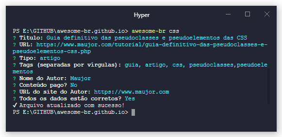

# Awesome-br-cli
[](https://travis-ci.org/welksonramos/awesome-br-cli) [](https://www.npmjs.com/package/awesome-br-cli) [](https://david-dm.org/welksonramos/awesome-br-cli) [](http://awesome-br.com/#/node)
> CLI para registrar novas postagens em [awesome-br](https://github.com/awesome-br)



# Requisitos
- [Node 8.9.0+](http://nodejs.org)

## Instalação

```bash
$ npm install -g awesome-br-cli

```

## Uso

Rode o seguinte comando no terminal, dentro do diretório **_`awesome-br.github.io`_**:

```bash
awesome-br <section>

Ex: awesome-br nodejs
```
### Outras Opções
```bash
$ awesome-br --help

  Usage: 
    awesome-br <section> [Options]

    Example:
     awesome-br nodejs

    Options:
     -h, --help      output usage information
     -V, --version   output the version number
```

## Questões

**Título:** Título da URL
> Exemplo: Começando com React

**URL**:
> Exemplo: http://exemplo.com

**Tipo:** Escolhe o tipo de link (artigo, código, dica, livro, screencast, vídeo, tutorial, url, etc)
> Exemplo: Artigo

**Tags:** Tags (separadas por vírgulas).
> Exemplo: tutorial, introdução, javascript

**Nome do Autor**
> Exemplo: John Doe

**URL do Site do Autor**
> Exemplo: http://exemplo.com

### Resultado
```bash
{
    "name": "Começando com React",
    "url": "http://exemplo.com",
    "type": "Artigo",
    "tags": [
      "tutorial",
      "introdução",
      "javascript"
    ],
    "paid": "false",
    "author": {
      "name": "John Doe",
      "url": "http://exemplo.com"
    }
  }
```
***Inspirado em _[freetime-cli](https://github.com/free-time/freetime-cli)_***

### Contribua
Gostaria de contribuir com o projeto [Siga estas recomendações](CONTRIBUTING.md)

## License

&copy; [MIT](LICENSE) License
